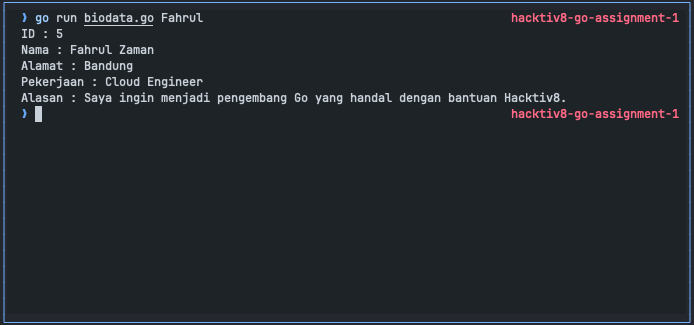

# MSIB Hacktiv8 Go Assignment 1

### Author

- ID : GLNG-KS07-06
- Nama : Fahrul Zaman
- Kelas : GLNG-KS07
- Universitas : Universitas Bale Bandung

### Notes

- [x] Main file is `biodata.go`
- [x] Program can search student by name

### Instructions

Buatlah sebuah service berupa CLI untuk menampilkan data teman-teman kalian dikelas.
Contohnya, ketika kalian menjalankan perintah `go run biodata.go thomas` maka data yang akan muncul adalah data teman kalian dengan absen no 1. Data yang harus ditampilkan yaitu:

- Nama
- Alamat
- Pekerjaan
- Alasan memilih kelas Golang Gunakanlah struct dan function untuk menampilkandata tersebut

Kalian bisa menggunakan os.Args untukmendapatkan argument pada terminal.

Flow teknis codingnya :

- import `os` dan `fmt`
- Buat logic untuk menampilkan/generate data peserta dari cli by name, contoh cli : `go run biodata.go Thomas`
- Buatlah looping yang memproses slice of string dari beberapa nama peserta, dimana jika nama yg di ketik pada cli sama dengan yang ada di data peserta maka akan dapat index dari data pesertanya dan di append pada data baru untuk ditampilkan pada CLI atau terminal.

### Test

### Thank You
